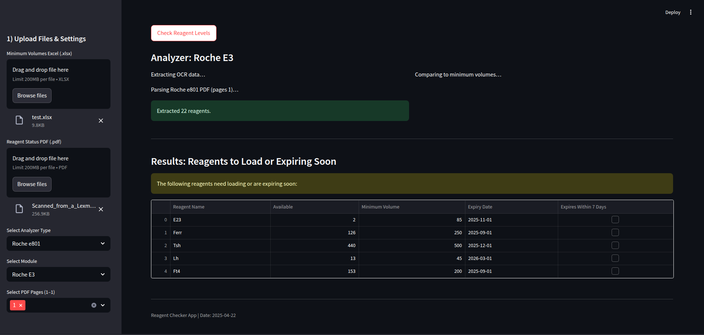

# Reagent Volume Checker

A Streamlit web application that automates reagent level monitoring for specific analyzers, aimed at reducing manual work and potential errors in the loading process.

---

## Features

- Upload PDF exports from supported analyzers (Roche e801 or Beckman AU5800)
- Upload an Excel file listing reagent minimum volumes per analyzer module
- Automatically extract reagent information using OCR
- Compare current reagent availability against minimum requirements
- Identify reagents that:
  - Are below the minimum volume
  - Are expiring within 7 days

---

## Supported Analyzers

- **Roche e801**
- **Beckman AU5800**  

---

## Input Requirements

### Excel Format (per sheet/module)
Each sheet represents a module (e.g., E3, E4), and should contain:

| Reagent Name | Minimum Volume |
|--------------|----------------|
| TSH          | 270            |
| SHBG         | 120            |

Column headers can vary slightly but must include keywords like "reagent" and "min vol".

### PDF Format
- Must be generated by the analyzer (e.g., via print to PDF or scan)
- For Beckman AU5800, landscape orientation is expected
- Multiple pages supported; users can choose which pages to process

---

## How to Run

1. Clone the repository:

```bash
git clone https://github.com/SethGK/reagent_volume_checker.git
cd reagent_volume_checker
```

2. Install requirements:
```bash
pip install -r requirements.txt
```

3. Launch the application:
```bash
streamlit run main_app.py
```

## Screenshots

### Results View



## Future Enhancements

- Support for additional analyzer types
- Historical tracking of reagent usage patterns

